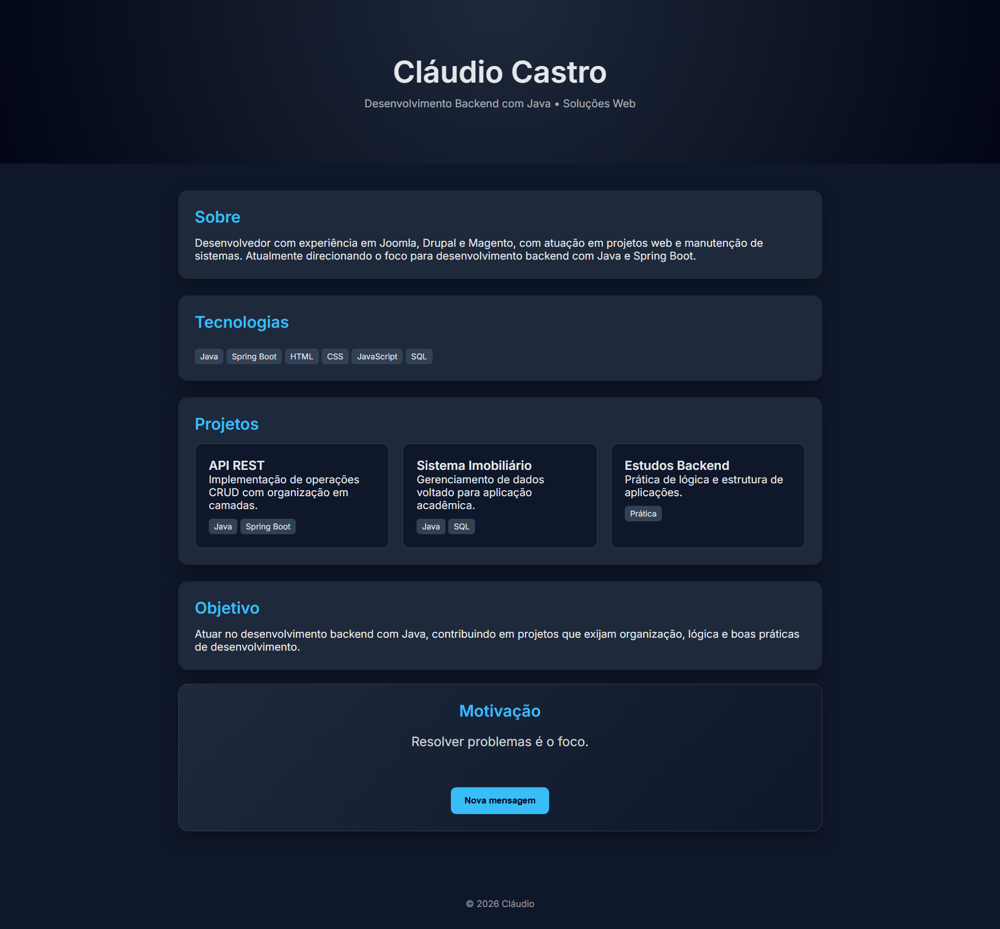

# Olá Mundo!
Primeiro repositorio Git e GitHub


# Projetos Futuros

Este projeto representa minha atuação e direcionamento no desenvolvimento de aplicações web, com foco em backend utilizando Java.


## Sobre

Desenvolvedor com experiência em Joomla, Drupal e Magento, atuando na criação e manutenção de soluções web.

Atualmente direcionando o foco para desenvolvimento backend com Java e Spring Boot, aplicando conceitos de organização de código, lógica e estrutura de sistemas.


## Tecnologias

* Java
* Spring Boot
* HTML
* CSS
* JavaScript
* SQL


## Estrutura do Projeto

O projeto consiste em uma página web com:

* Apresentação profissional
* Seção de tecnologias
* Projetos em desenvolvimento
* Componente interativo com mensagens dinâmicas


## Projetos

* API REST com Spring Boot (CRUD)
* Sistema imobiliário (acadêmico)
* Práticas de backend


## Objetivo

Atuar no desenvolvimento backend com Java, contribuindo em projetos que exijam organização, lógica e boas práticas.


## Como executar

1. Clone o repositório:

```
git clone  https://github.com/claudiodeveloper-github/projetos-futuros-java.git
```

2. Abra o arquivo `index.html` no navegador


## 📷 Preview




## Autor

Cláudio G. S. Castro
